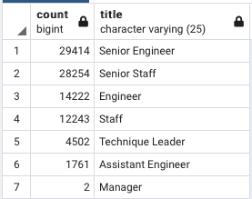
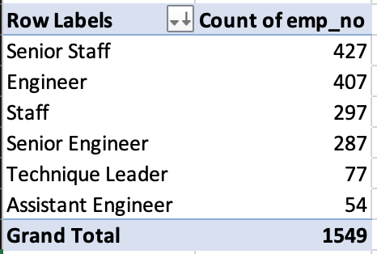

# Module 7: Pewlett-Hackard-Analysis

## Overview of Project
Using pgAdmin4 to identify future retirements and mentorship candidates within Pewlett-Hackard which will help prepare them for the “silver tsunami” as many current employees reach retirement age.
**Note:  I was a bit unsure about the file structure based on the instructions.  The 'Data' and 'Queries' folders can be found using the following path: 'Pewlett-Hackard-Analysis/Analysis_Projects_Folder/Pewlett-Hackard-Analysis_Folder'.  All my Challenge work was completed in the Module7 query.  I then copied and pasted the Challenge sequel script into the 'Employee_Database_challenge.sql' file.**

### Purpose
Pewlett-Hackard has requested the following:
* Determine the number of retiring employees per title
* Identify employees who are eligible to participate in a mentorship program.
 
 
 
## Results

* The total number of people retiring is 90,398 employees
* The job title with the largest number of retirement aged employees is Senior Engineers at 29,414 employees. (See chart below.)

#### Count of Employees at Retirement Age by Job Title

* The number of people eligible to participate in a mentorship program is much less than the number of people at retirement age. (Compare chart below with chart above.)
* There are only 748 engineers eligible for a mentorship program.

#### Count of Employees Eligible for a Mentorship Program (Pivot Table created from 'mentorship_eligibility.CSV file)

## Summary: 
* How many roles will need to be filled as the "silver tsunami" begins to make an impact?
  Answer:  90,398
  
* Are there enough qualified, retirement-ready employees in the departments to mentor the next generation of Pewlett Hackard employees?
  Answer:  Yes
  
* Provide two additional queries or tables that may provide more insight into the upcoming "silver tsunami."
  Answer:
   * Add the date that employees are first elligible to retire to 'unique_titles'.  This may help identify those that are more likely to retire based on when they became eligible to retire.
   * Adding salary to 'unique titles' would provide Pewlett-Hackard incite into potential savings from paying higher wages of retirement aged employees.
   * Create a table showing employees that need to become eligible for the mentorship program

